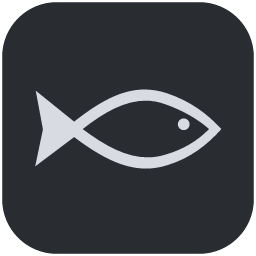

# 直播摸鱼 · LiveMoyu



在工作窗口前台听 B 站直播时，按快捷键唤起悬浮输入框，输入弹幕并回车发送，无需切换到直播页面。

**Windows x64 桌面程序 + Microsoft Edge 扩展**。直播继续在浏览器后台播放，使用网页现有的登录状态和发送流程。

## 下载与安装

到 [最新版本](https://github.com/amount-chen/live-moyu/releases/latest) 下载 `LiveMoyu-Setup-0.2.3.exe`。

1. 运行安装包并启动“直播摸鱼”。默认不开机自启。
2. 点击悬浮框的 **设置 → 打开扩展文件夹**。
3. 在 Edge 打开 `edge://extensions`，开启开发人员模式，选择 **加载解压缩的扩展**，加载上一步的文件夹。
4. 打开并登录 B 站直播间，刷新页面，点击“直播摸鱼 · 悬浮输入连接器”扩展，选择 **绑定当前直播间**。
5. 切回工作窗口，按 `Ctrl+Alt+B`，输入弹幕并回车。

安装包已包含扩展；Release 中的 `LiveMoyu-Edge-0.2.3.zip` 是同一连接器的独立分发包（内部扩展版本为 0.2.0）。ZIP 需解压后加载，单独安装扩展仍需要桌面程序。

升级时先从系统托盘退出旧版，再安装到原目录。当前安装包未进行 Windows 代码签名，尚未上架 Edge 扩展商店。

完整操作、排错和卸载步骤见 [使用说明](使用说明.md)。

## 功能

- 全局快捷键唤起并聚焦，可在设置中修改；冲突时保留原快捷键并提示。
- 回车发送，中文输入法选词期间不发送；发送过程中防止重复提交。
- 确认服务器接受后清空并收起，尝试恢复之前工作窗口的焦点。
- Esc 隐藏并保留草稿；失败或结果不明确时保留文字，不自动重发。
- 标题栏一键切换白色 / 深色模式，以及只有输入区和恢复按钮的小窗模式。
- 支持拖动，记住位置、主题和窗口模式。
- 同时绑定一个标签页；同一房间刷新后重连，关闭或切换房间后需重新绑定。

## 使用范围与隐私

目前支持 Windows x64、Microsoft Edge 和普通文字弹幕。需要保持已登录的直播页打开；浏览器重启后重新绑定。项目与哔哩哔哩无隶属关系。

程序不保存或导出账号密码、Cookie 或弹幕正文，不收集遥测。草稿只在内存中保留，退出程序后丢失。桌面端保存窗口偏好和本地通信配置，通过当前 Windows 用户的命名管道与扩展通信，不开放 TCP 监听端口。

“发送成功”表示观察到网页发送请求的服务器接受响应，不保证弹幕通过平台审核或对其他观众可见。B 站页面、接口或浏览器行为变化可能影响发送；结果无法确认时需查看直播间，手动核对后再决定是否重发。

通知区域的小鱼为透明背景纯黑色，深色任务栏上可能不够醒目。

## 开发与构建

使用 Windows x64、Node.js 22.12+ 及 npm，Windows .NET Framework 4 编译器需可用（通常随系统提供，无需 .NET SDK）。

```powershell
npm ci
npm run native
npm test
npm run check
npm start
```

生成安装包：

```powershell
npm run dist
```

输出位于 `dist/`。开发启动会注册当前源码目录的 Native Messaging 组件；启动已安装版本可将注册路径恢复到安装目录。

| 目录 | 内容 |
| --- | --- |
| `desktop/` | Electron 悬浮窗、主题、输入与焦点管理 |
| `full-extension/` | 正式 Edge 连接器 |
| `native/` | C# Native Messaging 与 Windows 焦点桥接 |
| `extension/` | 早期手动验证工具，普通用户无需安装 |
| `tests/` | 模拟页面及消息链路测试 |
| `scripts/` | 图标生成、构建与检查脚本 |

扩展清单中的 `key` 是用于稳定扩展 ID 的公钥，不是登录凭据。桌面桥接仅允许对应扩展 ID；自行更改 ID 时必须同步调整桥接配置。

已有 19 项自动测试覆盖防重复、输入保护、页面响应关联、断线和未确认结果处理等。项目使用者已报告后台标签页、窗口遮挡、Edge 最小化及完整真实使用场景通过；这不代表已覆盖所有系统和浏览器版本。

## 反馈与许可

请通过 [Issues](https://github.com/amount-chen/live-moyu/issues) 提交问题，附上版本、系统、操作步骤及错误提示。截图请遮挡个人信息；不要提交账号密码、Cookie 或 Token。

本项目源码采用 [MIT License](LICENSE)。依赖软件保留各自许可证。
